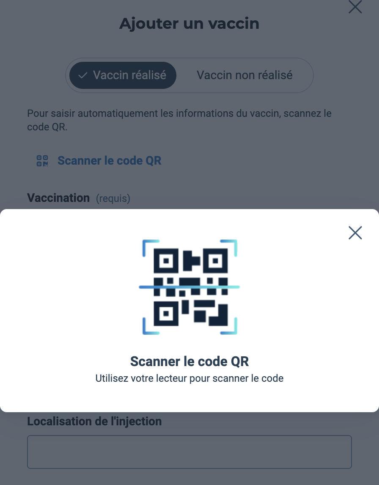

  

<h1 align="center">VitalScanner</h1>

  Remplacez votre scannette USB par la webcam de votre Mac. 
  Scannez les QR codes, codes Data Matrix et codes-barres, et injectez-les directement dans votre logiciel métier.

  <a href="https://github.com/torfeuzarre/VitalScanner-releases/releases/latest/download/Installer-VitalScanner.pkg">Télécharger la dernière version</a>

---

## Cas d'usage

### Lecture de la carte Vitale

Quand Doctolib vous demande de lire la carte Vitale avec une scannette :

  

### Remplissage automatique des vaccins

Scannez le code Data Matrix d'un vaccin pour remplir automatiquement les informations :

  

VitalScanner utilise la webcam de votre Mac pour scanner les QR codes et simule la frappe clavier — exactement comme une scannette USB physique.

L'application devrait également fonctionner pour les autres codes à scanner dans Doctolib (mutuelles, ordonnances, etc.), bien que cela n'ait pas encore été testé.

> **Note :** VitalScanner a été testé uniquement avec Doctolib. Le fonctionnement avec d'autres logiciels de santé n'est pas garanti.

## Fonctionnement

1. **Cliquez sur l'icône** dans la barre des menus (ou utilisez le raccourci **⌘⇧S**)
2. **Présentez le QR code** devant la webcam
3. **Le code est injecté automatiquement** dans le logiciel, comme avec une scannette USB

## Installation

1. [Téléchargez l'installeur `Installer-VitalScanner.pkg`](https://github.com/torfeuzarre/VitalScanner-releases/releases/latest/download/Installer-VitalScanner.pkg)
2. Double-cliquez dessus et suivez l'installeur : VitalScanner est installé dans **Applications**, puis s'ouvre automatiquement
3. Autorisez l'accès à la **caméra** et à l'**accessibilité** (nécessaire pour simuler la frappe clavier)

> Le fichier `.zip` joint à chaque version sert uniquement aux mises à jour automatiques : inutile de le télécharger.

## Configuration requise

- macOS 14 (Sonoma) ou plus récent
- Webcam intégrée ou externe

## Mises à jour

L'application vérifie automatiquement les mises à jour. Vous pouvez aussi vérifier manuellement via **clic droit sur l'icône → Rechercher des mises à jour…**

## Confidentialité

Aucune donnée n'est collectée ni transmise. Tous les traitements (capture vidéo, détection de codes, frappe clavier) sont effectués en local sur votre Mac.

## Développé par

Benjamin Wolff
